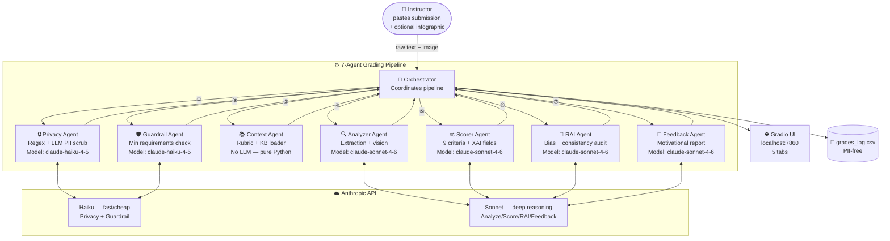

# Assignment 1.5 Multi-Agent Grader — ML Visual Framework

Automated grading system for Indiana Wesleyan University **Assignment 1.5: ML Algorithm Visual Framework** (75-point portfolio artifact). Features privacy-first design, XAI transparency, and a Responsible AI fairness audit.

> See [`docs/video_transcript.md`](docs/video_transcript.md) for a full 6-minute walkthrough transcript.

---

## Multi-Agent Architecture



> Full diagram with node details: [`docs/architecture.md`](docs/architecture.md)

---

## Communication Protocols

All agents communicate **sequentially through the Orchestrator** — no agent contacts another directly.

```
① Raw text ──► Privacy Agent ──► scrubbed_text + privacy_audit (dict)
② rubric_path ──► Context Agent ──► context_string (str, ~3000 chars)
③ scrubbed_text + context ──► Guardrail Agent ──► guardrail_report (JSON)
    └─ IF fails → HALT pipeline, return GradeReport(halted=True)
④ scrubbed_text + context + image_b64? ──► Analyzer Agent ──► analysis (str)
⑤ analysis + scrubbed_text + context + rubric ──► Scorer Agent ──► scores (JSON)
⑥ scores + scrubbed_text + context ──► RAI Agent ──► rai_report + adjustments (JSON)
    └─ Orchestrator applies any recommended score adjustments
⑦ adjusted_scores + analysis + rai_report + context ──► Feedback Agent ──► feedback (str)
```

> Full protocol specs with JSON schemas: [`docs/communication_protocols.md`](docs/communication_protocols.md)

---

## Guardrails & Safety Features

| Feature | Implementation |
|---------|---------------|
| **Privacy scrubbing** | 2-pass: regex (email, phone, SSN, student ID) → Haiku LLM (names, institutions, handles) |
| **Submission validation** | Minimum 8 algorithms, relevance check, word count, inappropriate content detection |
| **Pipeline halt** | Grading stops if guardrails fail; instructor sees clear reason |
| **XAI transparency** | Every score includes: confidence (0–1), evidence (direct quote), counterfactual |
| **RAI bias audit** | 6 bias types checked: style, halo, recency, length, vocabulary, inconsistency |
| **Score adjustment** | RAI-recommended corrections applied before student sees grade |
| **Human review flag** | Borderline or ambiguous submissions flagged for instructor review |

---

## XAI / RAI Elements

### Explainable AI (XAI)
Every rubric criterion score includes:
- **Confidence** `0.0–1.0` — how clear-cut is the evidence?
- **Evidence** — direct quote from the submission supporting the score
- **Rationale** — why this level, not higher or lower
- **Counterfactual** — exactly what the student needs to do to earn a higher score
- **Uncertainty notes** — any ambiguity acknowledged explicitly

### Responsible AI (RAI)
Post-scoring audit checks for:
- Internal score consistency across criteria
- Six named bias types (style, halo, recency, length, vocabulary, inconsistency)
- Evidence quality (are scores grounded in content or assumptions?)
- Fairness concerns (criteria that may unfairly disadvantage the student)
- Recommended adjustments with specific rationale

---

## Rubric (75 points)

| Criterion | Max | Excellent | Competent | Needs Improvement | Inadequate |
|-----------|-----|-----------|-----------|-------------------|------------|
| Clarity & Organization | 10 | 10 | 9 | 8 | 6 |
| Visual Appeal & Professionalism | 8 | 8 | 7 | 6 | 4 |
| Technical Execution | 7 | 7 | 6 | 5 | 4 |
| Classification Accuracy | 10 | 10 | 9 | 8 | 7 |
| Representation of Relationships | 8 | 8 | 7 | 6 | 5 |
| Comprehensiveness | 7 | 7 | 6 | 5 | 4 |
| Explanation of Classification Process | 8 | 8 | 7 | 6 | 5 |
| Reflection on Learning | 9 | 9 | 8 | 7 | 6 |
| Writing Quality | 8 | 8 | 7 | 6 | 5 |

Overall: Excellent ≥69 | Competent ≥61 | Needs Improvement ≥54 | Inadequate <54

---

## Model Tuning

| Agent | Model | max_tokens | Rationale |
|-------|-------|-----------|-----------|
| Privacy | Haiku | dynamic | Mechanical transformation — Haiku cost-optimal |
| Guardrail | Haiku | 600 | Boolean JSON classification — tight budget |
| Analyzer | Sonnet | 1500 | Nuanced extraction + optional vision |
| Scorer | Sonnet | 3000 | 9 criteria × 5 XAI fields each |
| RAI | Sonnet | 1500 | Meta-reasoning about scorer output |
| Feedback | Sonnet | 1200 | ~400-500 word empathetic prose |

> Full tuning rationale and prompt engineering decisions: [`docs/model_tuning.md`](docs/model_tuning.md)

---

## Setup

```bash
git clone https://github.com/johnnyCRF450/grader_1_5.git
cd grader_1_5
pip install anthropic gradio

export ANTHROPIC_API_KEY="sk-ant-..."  # or add to ~/.zshrc
python app.py   # opens at http://localhost:7860
```

---

## Workflow

1. Log into Brightspace → open student submission
2. Copy full submission text
3. Open `http://localhost:7860`
4. Paste text, enter student name, optionally upload infographic image
5. Click **Grade Submission**
6. Review tabs: Privacy & Guardrails → XAI Scores → RAI Audit → Feedback
7. Copy feedback into Brightspace

All grades logged (PII-free) to `grades_log.csv`.

---

## File Structure

```
grader_1_5/
├── agents/
│   ├── privacy_agent.py          # PII scrubbing (regex + LLM)
│   ├── guardrail_agent.py        # Submission validation + halt logic
│   ├── context_agent.py          # Rubric + knowledge base loader
│   ├── analyzer_agent.py         # Element extraction + vision support
│   ├── scorer_agent.py           # XAI scoring (9 criteria)
│   ├── rai_agent.py              # Bias detection + fairness audit
│   └── feedback_agent.py         # Motivational grade report
├── docs/
│   ├── architecture.md           # Full Mermaid architecture diagram
│   ├── communication_protocols.md # Protocol specs + JSON schemas
│   ├── model_tuning.md           # Parameter decisions + trade-offs
│   └── video_transcript.md       # 6-minute walkthrough transcript
├── app.py                        # Gradio web UI (5 tabs)
├── assignment_context.py         # ML algorithm knowledge base (18 algorithms)
├── orchestrator.py               # 7-agent pipeline coordinator
├── rubric.json                   # Assignment 1.5 rubric
└── grades_log.csv                # Auto-generated, gitignored
```

---

## Comparison: Assignment 1.4 vs 1.5 Grader

| Feature | 1.4 Grader | 1.5 Grader |
|---------|-----------|-----------|
| Agents | 4 | 7 |
| Privacy scrubbing | ❌ | ✅ Two-pass |
| Guardrail validation | ❌ | ✅ With halt logic |
| XAI transparency | ❌ | ✅ Confidence + evidence + counterfactual |
| RAI bias audit | ❌ | ✅ 6 bias types + adjustments |
| Vision support | ❌ | ✅ Infographic analysis |
| Model tiers | Sonnet only | Haiku + Sonnet |
| UI tabs | 1 | 5 |
| Algorithm knowledge base | Dataset-specific | 18-algorithm ML reference |
