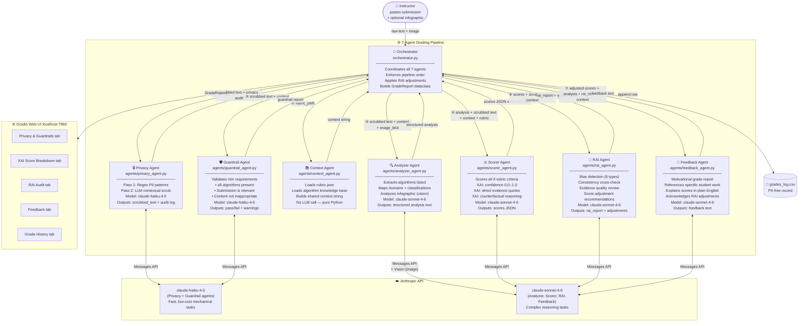

# Multi-Agent Architecture — Assignment 1.5 Grader

## System Overview



## Agent Roles

| Agent | Model | Purpose | Guardrail Role |
|-------|-------|---------|----------------|
| Privacy | Haiku | Scrub PII before any data leaves the system | First line — protects student identity |
| Guardrail | Haiku | Validate minimum submission requirements | Second line — prevents garbage-in |
| Context | None (Python) | Build shared ground truth for all agents | Ensures consistent rubric + KB reference |
| Analyzer | Sonnet | Extract structured elements from submission | Separates understanding from judgment |
| Scorer | Sonnet | Score 9 criteria with XAI transparency | Core grading with confidence tracking |
| RAI | Sonnet | Audit for bias, consistency, fairness | Post-hoc fairness check before student sees grade |
| Feedback | Sonnet | Generate motivational, transparent report | Ensures communication is constructive |

## Halt Conditions

The pipeline halts after Guardrail validation if:
- Submission is not relevant to ML algorithms
- Fewer than 8 algorithms are present
- Submission is under 150 words
- Inappropriate content detected

A halted submission is logged with the halt reason and flagged for human review.
```